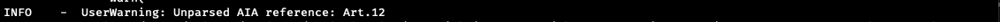
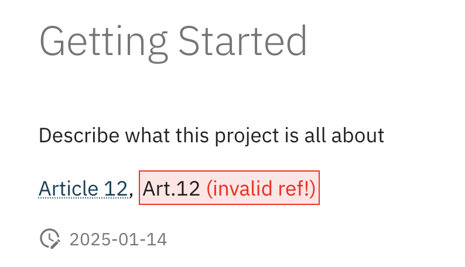

# Contributing

The goal of this project is to be a repository of useful and valuable information
regarding the conception and implementation of trustworthy AI systems, in a broader sense.
We aim to make connections to the EU AI Act, where possible and meaningful.

Contributions are highly welcome from anyone in the form of [issues](https://github.com/aai-institute/twai-pipeline/issues), [discussions](https://github.com/aai-institute/twai-pipeline/discussions), feature and [pull requests](https://github.com/aai-institute/twai-pipeline/pulls).

In any case you can always ask any question in the
[discussions](https://github.com/aai-institute/twai-pipeline/discussions) section.


## Local development

If you want to contribute to the project by providing resources yourself,
please fork the repository and create a pull request with your changes.

Using the github cli:
```
gh repo fork --clone=true aai-institute/twai-pipeline
```

### Setting up the environment

The project uses [uv](https://github.com/astral-sh/uv) as a package
manager. Follow the [installation instructions](https://docs.astral.sh/uv/getting-started/installation/) to have uv available on your machine.

After installation, you can run scripts with
```python
uv run scripts/hello_twai.py
```

### Documentation

To build the documentation locally, run the following command:
```
uv run --group docs mkdocs serve
```
The local build is served at port [8000](http://127.0.0.1:8000/).

When you would like to cite a specific part of the AI Act, you can use the 
following format in MarkDown:

```MarkDown
|Art. 6|, |Article 13.3 (ii)|, |Annex II|, |Recital 23|
```

In case there is a wrong format in the citation 
(e.g. missing a whitespace |Art.6|). The console will log a UserWarning



and in the local build, you will see something like this




