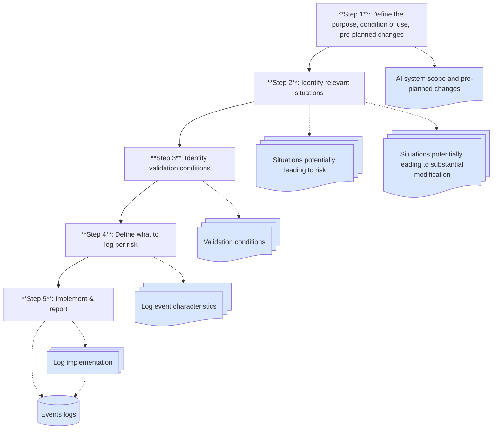

# Record-Keeping

|Article 12| of the AI Act sets out requirements for record-keeping by providers of high-risk AI systems.

!!! info "Engineering Info"

    --8<-- "docs/conformity/\_engineering-info-box.partial"

    - [Inference Log], logging inference events including corresponding meta information
            allows in particular for:
        - |Art. 12(2)(a)|: Identifying inputs, which cause an unwanted behavior of the system
        - |Art. 12(2)(b)|: Drift detection as a realization of a post-market monitoring
        - |Art. 12(2)(c)|: Monitoring of the AI system's operation
    - [Experiment Tracking]:
        - |Art. 12(2)(a)|: Backtracking to used training data
    - [Data Versioning]:
        - |Art. 12(2)(a)|: Identifying used datasets (training and reference data) by a unique identifier
    - [Orchestration]:
        - |Art. 12(2)(a)|: Reconstructing a complete model generation process through usage
            of a unique run id

## What is record-keeping?

Record-keeping is the practice of keeping records of events (logs) of an AI system throughout its lifetime.
This includes the automatic collection, storage, and processing of appropriate data that is relevant to the intended purpose of the AI system.

## What should be recorded?

The AI Act does not provide specific guidance on what concrete data should be recorded.
Rather, the necessary data should be determined based on the results of the risk assessment and the intended purpose of the AI system, so that any deviations from the safe operation of the AI system can be detected.

### General requirements

|Art. 12(2)| calls for a compliant record-keeping system to capture data that allows:

-   Identification of situations that may result in the _system presenting a risk_ within the meaning of |Art. 79(1)|
-   Identification of situations that may lead to a _substantial modification_ of the AI system
-   [_Post-market monitoring_](#post-market-monitoring) of the AI system as defined in |Art. 72|
-   [_Monitoring_](#monitoring-of-operations-by-deployers) of the AI system's operation by the deployer, as defined in |Art. 26(5)|.

The draft standard [prEN ISO/IEC 24970 (Artificial intelligence — AI system logging)](https://www.iso.org/standard/88723.html) will provide concrete guidance on the implementation of the event logging.
It is intended to be used with a [risk management system](risk-management-system.md), such as required by |Art. 9|.

For special categories of AI systems, such as remote biometrics identification systems, |Art. 12(3)| mandates additional data to be recorded.
However, these systems are out of scope for this website.

### Process description

The following diagram illustrates a schematic process for identifying the necessary logs to be kept for a high-risk AI system:

<figure style="width: 100%;">

</figure>

For each of the identified risks and substantial modifications, the following action should be taken (step 4 in the flowchart):

-   _Developer consultation_: Check with developers if existing logs can track the events that lead to the risk. If not, define new events that need to be logged.
-   _Log importance evaluation_: Assess the cost/benefit ratio of logging the new events.
-   _Log characteristics_: Define the frequency, resolution, format, and other characteristics for each log.

Lastly, implement the logging and reporting to the governance team (step 5):

-   _Comprehensive logs_: Capture who, what, when, and outcomes of key events
-   _Stakeholder reporting_: Set up processes for accessing logs and reporting
-   _Access management_: Define who can access logs and under what conditions
-   [_Model logging_](../engineering-practice/inference-log.md): Record input/output data, timestamps, expected outputs, and user changes
-   _Violation logs_: Extend logs to include performance and MLOps KPI violations
-   _Detailed event logs_: Maintain logs of significant events, including performance metrics and user actions

## Post-Market Monitoring

Providers of high-risk AI systems must establish a post-market monitoring system to ensure that the AI system continues to comply with the requirements of the AI Act.

|Art. 3, point (25)| defines a post-market monitoring system as follows:

> [...] all activities carried out by providers of AI systems to collect and review experience gained from the use of AI systems they place on the market or put into service for the purpose of identifying any need to immediately apply any necessary corrective or preventive actions;

A post-market monitoring system for high-risk AI systems must fulfill the following requirements, as set out in |Art. 72|:

-   Be established and documented based on a _post-market monitoring plan_, proportionate to the risk of the AI system
-   Allow for _systematic collection, documentation, and analysis of performance data_ to evaluated the ongoing compliance of the AI system with the requirements for high-risk AI systems
-   If necessary, _interactions with other AI systems_ must be analyzed

If the system falls under established Harmonized legislation under |Annex I(A)| and a post-market surveillance system is already in place, the requirements of |Art. 72| can be fulfilled by integrating the template from |Art. 72(3)| with the existing systems/plans.

In particular, the EU Commission will publish a template for the post-market monitoring plan by February 2026 (see |Art. 72(3)|).
This template will describe the elements to be included in the plan as part of the technical documentation for the AI system.

## Monitoring of Operations by Deployers

Deployers of high-risk AI systems must monitor the operation of the AI system to ensure that it complies with the requirements of the AI Act.
|Art. 26(5)| requires them to:

-   _Monitor systems_ based on the instructions for use
-   If using the system (in accordance with the instructions for use) could present a risk under |Art. 79(1)|, to _inform the provider_ or distributor and the relevant market surveillance authorities (see |Art. 3, point (26)|) and suspend use of the system.
-   _Report any serious incidents_ (see |Art. 3, point (49)|) to the provider first, and then to importer/distributor and the relevant market surveillance authorities of that incident.

Notifications to the providers should be made in accordance with |Art. 72|, which ties together the responsibilities of the deployer and the provider in the post-market monitoring of the AI system.
In case the provider cannot be reached, the notification duties outlined in |Art. 73| fall on the deployer.

Special provisions apply to law enforcement authorities and financial institutions, but are out of scope for this document.

|Art. 26(6)| requires the automatically generated logs to be kept for a period appropriate to the intended use of the system, but at least 6 months.
If any other legal requirements apply (e.g., recording requirements under GDPR), the logs must be kept for the longer of the two periods.

## Checklist

The following checklist can help you assess the compliance of your record-keeping system with the requirements of the AI Act:

### |Art. 12(2)(a)| requirements

-   [ ] Conditions under which a risk is deemed unacceptable in relation to the (reasonably foreseeable) intended use have been identified
-   [ ] Conditions under which a system might be substantially modified have been identified
-   [ ] Log metrics to track events that might lead to these conditions have been identified and documented

### |Art. 12(2)(b) and (c)| requirements

-   [ ] Events that could affect compliance have been identified and relevant log metrics have been prepared
-   [ ] Events that could affect the performance of the system have been identified and relevant log metrics have been identified and documented

<!-- Reference Links -->

[Inference Log]: ../engineering-practice/inference-log.md
[Data Versioning]: ../engineering-practice/data-governance/data-versioning.md
[Orchestration]: ../engineering-practice/orchestration.md
[Experiment Tracking]: ../engineering-practice/experiment-tracking.md
[Model Monitoring]: ../engineering-practice/model-monitoring.md
