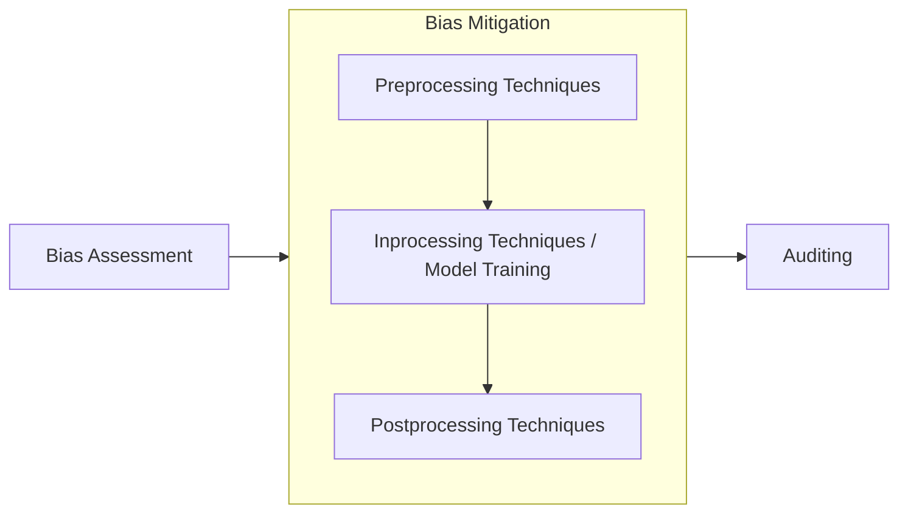

!!! success "Compliance Info"

    --8<-- "docs/engineering-practice/_compliance-info-box.partial"

    - **|Art. 10|** (Data and Data Governance), in particular:
        - **|Art. 10(2)(g)|**: Appropriate measures for bias detection, prevention, and mitigation
        - **|Art. 10(3)|**: Assert appropriate statistical properties regarding natural persons related to the use of the high-risk AI system
        - **|Art. 10(5)|**: Use of special categories of personal data in bias detection and correction

## Motivation

Biases are commonly considered one of the most detrimental effects of artificial intelligence (AI)
use.

|Art. 10| mandates the examination, detection, prevention, and mitigation of biases present in the data that could result in a harmful impact to health, safety, or fundamental rights.

As such, data governance activities should include practices to cover these requirements and map them to activities in the machine learning lifecycle.

## Implementation Notes

### Bias and Fairness Analysis Techniques

-   **Conduct Exploratory Data Analysis (EDA)**: Analyze the dataset for imbalances or patterns that may suggest bias, such as over-representation or under-representation of certain groups.
-   **Fairness Metrics**: Calculate fairness metrics such as demographic parity, equalized odds or disparate impact to quantify bias in datasets and model outputs.
-   See [fairlearn documentation](https://fairlearn.org/v0.12/user_guide/assessment/common_fairness_metrics.html) for an introduction to commonly used metrics

-   **Diversity Analysis:** Evaluate the dataset's demographic diversity, ensuring it represents all relevant populations appropriately.

    -   **Group Representation:**
        Checks whether groups are proportionally represented in the dataset (calculate as fraction of the total dataset size)
    -   **Overall Accuracy Equality:**
        Ensures that accuracy rates are equal across groups.

### Mitigation Techniques

Bias mitigation techniques broadly fall into three categories, based on their applicability during the machine learning lifecycle:

#### Preprocessing Techniques

-   Resampling Techniques: Use oversampling or undersampling to balance the representation of different demographic groups.
-   Synthetic Data Generation: Generate synthetic examples for under-represented groups to ensure better balance in the dataset.
-   Reweighing: Adjust the weights of data instances to ensure fair representation across groups.

#### Inprocessing Techniques / Model Training

-   Bias-Corrected Features: Transform features to reduce correlations with sensitive attributes (e.g., gender, race).
-   Fair Representations: Use fairness-aware models that explicitly optimize for fairness metrics alongside predictive accuracy.

#### Post-processing Techniques

-   Outcome Adjustments: Adjust decision thresholds or outputs to ensure equitable outcomes across demographic groups.
    -   Equalized Odds Postprocessing: Modifies predictions to satisfy equalized odds constraints.
-   Bias Mitigation Strategies: Apply fairness postprocessing methods, such as calibration by group or equalized odds adjustments.

### Auditing

Regularly audit data to ensure it is free from systemic errors or biases.

-   Segmentation Analysis: Partition the dataset based on sensitive attributes and assess performance metrics for each segment to detect disparities.
-   Subgroup Fairness Checks: Compare outcomes for different demographic subgroups to identify discrepancies.
-   Drift Detection: Use tools to detect data or model drift that may reintroduce bias over time.

### Privacy Concerns

TODO: Discuss requirements of |Art. 10(5)|.

## Key Technologies

-   [AI Fairness 360 (`aif360`)](https://aif360.readthedocs.io/en/stable/) by IBM
-   [Fairlearn](https://fairlearn.org) by Microsoft
-   [What-if Tool](https://pair-code.github.io/what-if-tool/) by Google
-   [`imblearn`](https://imbalanced-learn.org/stable/) Python package for scikit-learn, provides tools when dealing with classification with imbalanced classes.

## Further Reading

-   [European Parliamentary Research Service (2022) - Auditing the quality of datasets used in algorithmic decision-making systems, Study](<https://www.europarl.europa.eu/RegData/etudes/STUD/2022/729541/EPRS_STU(2022)729541_EN.pdf>)
-   [Caton, Haas (2024) - Fairness in Machine Learning: A Survey](https://dl.acm.org/doi/full/10.1145/3616865)
-   [Barocas, Hardt, Narayanan (2023) - Fairness and Machine Learning: Limitations and Opportunities](https://www.fairmlbook.org/)
