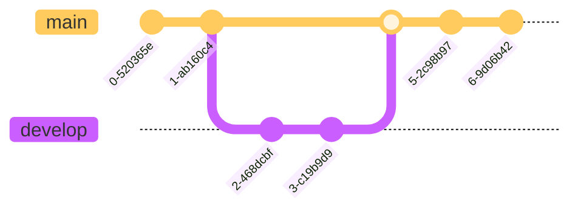

---
tags:
    - phase::data engineering
    - phase::modeling
---

# Data versioning

!!! success "Compliance Info"

    --8<-- "docs/engineering-practice/_compliance-info-box.partial"

    - **|Art. 10|** (Data and Data Governance), in particular:
        - **|Art. 10(2)(b)|**: tracking the origin of data,
        - **|Art. 10(2)(e)|**: assessment of availability, quantity and suitability of the data sets, and

## Motivation

In fast-moving, complex environments such as the subject of AI, it is vital to keep track of where data and information originated,
not only to be transparent, or to easily share work with colleagues, but to be able to identify the root cause in the event of a problem with your system.

In the software engineering world, distributed version control systems (VCS) have seen wide adoption because they address all of these concerns.
Through a set of basic abstractions, they provide bookkeeping powers by means of unique and immutable references, distributed storage for work sharing, and a graph-based history building for detailed information keeping.
Consequently, _data version control_ or _data versioning_ systems can be thought of as the similar approach to all data _artifacts_ produced by your machine learning systems.

In addition, a data version control system should come with security features such as role-based access control (RBAC) and restrict access to data to authorized personnel and systems only. This is a requirement of |Art. 15(5)| (measures to prevent manipulation of the training data set).

## Implementation notes

To add data versioning to a machine learning project, it is important to figure out a few steps:

1. **Collaborative development.**

A suitable data version control system needs to accommodate multiple engineers working simultaneously on different versions of the data, and ensure that changes made by one engineer do not invalidate the work of another.
This can be done for example by using a _branch_ workflow, where each person has their own siloed copy of the data, and can make changes to it without changing the canonical version (the "main" branch in this model).

<figure markdown="span">

  <figcaption>A branching data version control approach, with commits (immutable snapshots of the data) shown as dots.</figcaption>
</figure>

2. **Distributed storage.**

A data version control system should be accessible for all developers, and host the data in an off-device location to ensure easy access, fault tolerance, and availability of backups.

3. **Communication with users.**

In addition to availability, security, and fault tolerance, it is necessary that the data version control system can be easily interfaced with in AI application code.
This usually means that a selection of API clients or SDKs is available for a variety of programming languages, which allows developers to efficiently interface with the data VCS.

4. **Security.**

A data version control system should implement role-based access control (RBAC) and restrict access to data to authorized personnel and systems only.

## Interoperability

-   Where applicable, ensure that datasets and documentation are interoperable with standard regulatory frameworks and can be audited by authorities.
    -   Standardize formats (e.g., CSV or Parquet files for tabular data)
    -   Centralize data storage (e.g., in a data lake or data warehouse) such that access to data sets can be given at any time, and it is not depending on data sets on local machines of ML Engineers and Data Scientists.

## Usage considerations

While data version control and "regular" version control sound similar, and the general operational model is the same, data versioning systems face unique challenges.
Most importantly, data assets can become very large in size, which makes storing entire data sets for each revision infeasible because of duplication, unless very small data sets are used.
Furthermore, data comes in lots of different formats, both structured (tables) or unstructured (raw text, images, videos), which makes it harder to test for changes (commonly called "diffing").
As such, it is a hard problem to design a data version control system capable of efficiently computing changes between data sets, while keeping the storage footprint of all data set diffs small.

In general, the following considerations can help you decide how to make good use of your data version control system:

* You should version data whenever changes to the dataset occur that could impact its use, reproducibility, or compatibility with downstream systems.
* Use version control abstractions to keep versions separate between different developers, different experiments, or both. For example, for lakeFS (see below), use branches to separate.
* As a rule of thumb, create versions when initially uploading data, when updating (new data, corrections, imputation), or after applying preprocessing steps (evaluate based on compute vs. storage requirements).
* For other reasons (experimentation on a new model, feature engineering, subsampling, ...), data versions can also be created to simplify bookkeeping, and to provide a clear relation between different use cases and their data.
* Use scheduled jobs (garbage collection) to remove stale versions, free up storage space, and declutter the version control view.
* When available, use auditing and annotation features to attach metadata to revisions, enabling you to keep track of modifications and their authors over time.

## Key technologies

--8<-- "docs/engineering-practice/_key-technologies-info.partial"

1. [lakeFS](https://lakefs.io)

lakeFS models a lot of its version control abstractions like the [git VCS](https://git-scm.com/) tool.
It builds a linear history on commits, separates different avenues of work with branches, allows annotating data with tags, and also has supported for a merge workflow.
It can be set up on either local storage or a cloud storage bucket of one of the larger providers (AWS, GCP, Azure).

2. [DVC](https://dvc.org/)

DVC is a pure-Python command-line interface (CLI) for versioning data and model artifacts resulting from ML pipelines.
In addition, it has functionality for local experiment tracking, and versioning data pipelines in git together with project source code.

3. [git-lfs](https://git-lfs.com)

Git Large File Storage (LFS) stores large data assets in remote locations, and replaces the data with text pointers in git, so that data and its usage are decoupled on the storage level.
It integrates with the git command-line interface, augmenting developers' existing git workflows intuitively, and reducing the learning curve that an addition of a standalone tool would bring.
