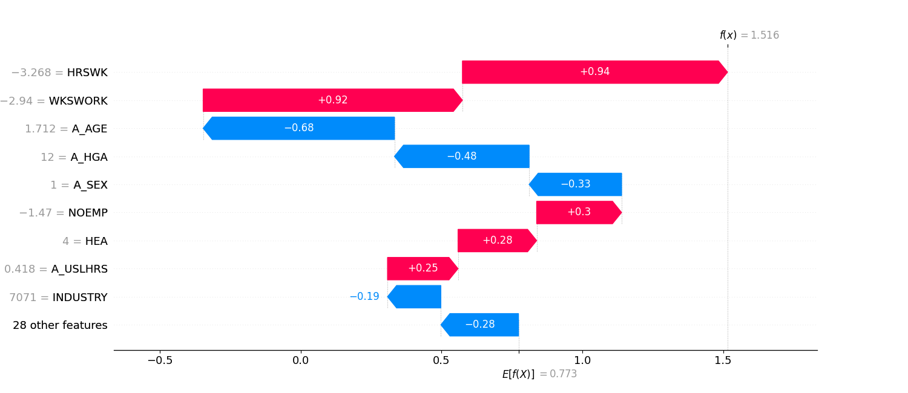

# Explainability

!!! success "Compliance Info"

    --8<-- "docs/engineering-practice/_compliance-info-box.partial"

    - **|Art. 13|** (Transparency and Provision of Information to Deployers), in particular:
        - |Art. 13(1)|: Explainability techniques contribute to a transparent system operation
        - |Art. 13(3)(b)(iv)|: Explainability techniques directly provide information relevant to explain the system's output
        - |Art. 13(3)(d)|: Explainability techniques can be used in the human oversight process to interpret the system's behavior
    - **|Art. 14|** (Human Oversight), in particular:
        -   |Art. 14(4)(c)|, since explainability approaches enable human interpretation of the system output
        -   |Art. 14(4)(d)|, explainability helps to decide if the output of the system should be disregarded
    - **|Art. 86(3)|** (Right to Explanation of Individual Decision-Making)
    - **|Art. 11(1)|** in conjunction with **|Annex IV|** (Technical Documentation), in particular:
        - |Annex IV(3)|: Explainability techniques can be part of the instructions for use to the deployer

## Motivation

Although there is no explicit demand for using explainability methods within the AI Act, they can aid compliance with the regulation, by providing insights into the system's decision-making process.

In particular, these explanation approaches can assist the operator of the system in interpreting the system's behavior, as part of the human oversight process (see |Art. 14|) and allow affected third parties to request an explanation of the system's output (see |Art. 86(3)|).
As part of the instructions for use to the deployer (see |Art. 13(3)(b)(iv)|), they can be used to provide information relevant to explain the system's output.

Furthermore, specific methods are easily available through existing software packages and utilizing them could be considered as best practice (see upcoming [ISO norm](#iso6254)).

Our showcase implementation focusses on a single explainability technique, the [SHAP](https://shap.readthedocs.io/en/latest/) (SHapley Additive exPlanations) approach.
This game-theoretic approach allows for post-hoc explanations in the form of highlighting each input feature's contribution to the model prediction.

## Implementation Notes

<!-- TODO: Link to inference server sub-page, when available -->

A custom inference server runtime implementation in MLserver is used to attach SHAP explanations to every model prediction.
This design ensures that every prediction made by the system can be explained at a later point in time, without the need for the original input data or model revision at the time of the explanation.
Contrast this with an implementation that would require access to the deployed model revision when an explanation is requested. In such a case, the model revision would need to be available (or deployed on demand) to generate the explanation.

The system exposes an `/model/explain` API endpoint, that allows a user to request explanations for a given model prediction (as identified by its request ID, which is automatically attached to any prediction output through an HTTP `X-Request-ID` header).

For a given inference request ID, the system retrieves the corresponding input, output, and explanation data from the [inference log](./inference-log.md), and returns a visual representation of the SHAP explanation for the prediction to the user:

## Key Technologies

-   The [`shap`](https://shap.readthedocs.io/en/latest/) Python package, implements the SHAP (SHapley Additive exPlanations) method
-   The [`lime`](https://lime-ml.readthedocs.io/en/latest/index.html) Python package, another popular model-agnostic explainability method (Local Interpretable Model-agnostic Explanations)
-   Use of intrinsically explainable models:
    -   The [`interpret`](https://interpret.ml/) Python package providing implementation for such glassbox models

## Resources

-   As a primer, [appliedAI TransferLab series on Explainable AI](https://transferlab.ai/series/explainable-ai/)
    and the accompanying [training](https://github.com/aai-institute/tfl-training-explainable-ai)
-   From the book [Trustworthy Machine Learning](https://trustworthyml.io/), Chapter about Explainability
-    The upcoming revision of the [ISO/IEC DTS 6254](https://www.iso.org/standard/82148.html) standard will describe approaches and methods used to achieve explainability objectives.
