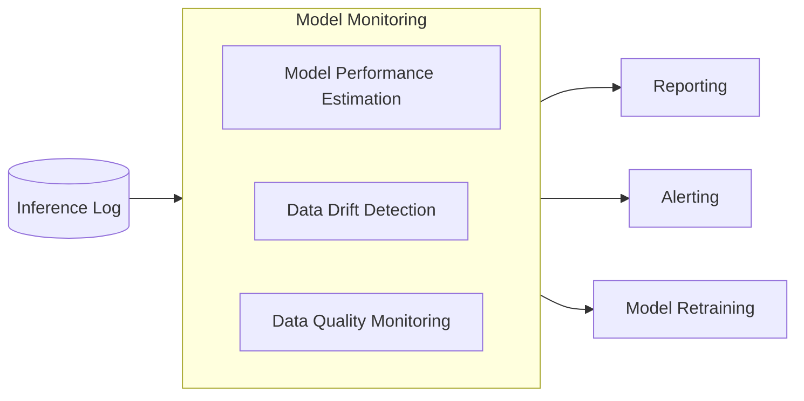

---
tags:
    - Art. 12
    - Art. 14
    - Art. 15
    - Art. 26
    - Art. 72
---

# Model Monitoring

!!! success "Compliance Info"

    --8<-- "docs/engineering-practice/_compliance-info-box.partial"

    Implementing a model performance solution will help you in achieving compliance with the following regulations:

    - **|Art. 12|** (Record-Keeping)
        - |Art. 12(1)| (Documentation of the AI system)
    - **|Art. 14|** (Human Oversight), in particular:
        -   |Art. 14(4)(a)|, automated tracking of drift and performance degradation
            helps to understand the capacities of the system during its lifetime
        -   |Art. 14(4)(e)|, observing degradation overtime enables to intervene and
            initialize a retraining, for example
    - **|Art. 15|** (Accuracy, Robustness and Cybersecurity), in particular:
        - |Art. 15(4)|, resilience and robustness through continuous monitoring of model performance
    - **|Art. 26(5)|** (Monitoring of the AI system's operation by the deployer)
    - **|Art. 72(2)|** (Post-market Monitoring), since a model monitoring solution allows for the continuous monitoring of the AI system's performance and compliance with legal requirements.

## Motivation

Monitoring is important to ensure that an AI system continues to operate as expected (that is, safely and reliably) after its deployment to production.
In practice, an AI system's performance can degrade over time for a number of reasons:

-   _Covariate shift_, where the distribution of inference inputs is sufficiently dissimilar from the training data.
-   _Label shift_, where the distribution of inference outputs is sufficiently dissimilar from the training data.
-   _Concept drift_, where the relationship between inference inputs and outputs changes over time.
-   Previously _unseen data_, which can lead to unexpected behavior of the model.
-   _Data quality issues_, such as missing or corrupted inference input data.
-   _Adversarial attacks_, where the model is intentionally abused by malicious actors.
-   _Badly calibrated models_, which can lead to overconfident predictions, especially in the case of out-of-distribution data.

Identifying these degradations early is key to mitigate accuracy and safety concerns due to inaccuracies of deployed AI systems, especially high-risk systems.

Monitoring is the first step in a feedback loop that can be used to trigger retraining of the model or other corrective actions.
By setting appropriate thresholds for the monitored metrics, the monitoring system can also be used to trigger alerts when the model's performance drops below an acceptable level.

Note that besides the ML-specific aspects, monitoring is also important for the overall system performance, see the page on [operational monitoring](./operational-monitoring.md).

## Implementation Notes

See the [showcase implementation](../showcase/implementation-notes/model-monitoring.md) for a concrete example of how to implement a model monitoring solution using the NannyML library.

Model monitoring is a complex task that requires a combination of different techniques and tools.
The following diagram illustrates the key components of a model monitoring solution:

### Model Performance Estimation

For supervised learning applications, the availability of labeled data poses a significant challenge.
When collecting previously unseen inference data in production (see the page on [inference logging](inference-log.md)), it is often not possible to collect the corresponding labels (either due to cost limitation of manual labeling or because the true labels are not known until a later point in time).

Algorithms that can estimate a model's performance in the absence of ground truth data can help in these scenarios.
See the section on [model monitoring](../showcase/implementation-notes/model-monitoring.md) for an example of classification performance estimation without ground truth data using the NannyML library.

### Data Drift Detection

Data drift detection is a key component of model monitoring.
It allows to identify when the distribution of inference inputs or outputs changes over time, which can lead to degraded performance.

### Data Quality Monitoring

Identifying data quality issues is essential for ensuring the reliability of the model's predictions.
Data quality monitoring can be used to identify issues such as missing or corrupted data, outliers, and other anomalies in the inference data.

Techniques for data quality monitoring include:

-   _Statistical tests_, such as the Kolmogorov-Smirnov and chi-squared tests, to identify changes in the distribution of the data.
-   _Anomaly detection algorithms_, such as isolation forests, to identify outliers in the data.
-   _Data validation techniques_, such as schema validation, to ensure that the data conforms to the expected format and structure. (see the page on [data quality](data-governance/data-quality.md) for more details)

### Reporting

The reporting component of a model monitoring solution is responsible for generating overview reports on the model's performance and data drift.
These reports can be used to track the model's performance over time and identify trends or anomalies and trigger alerts when the model's performance drops below an acceptable level (see the next section).

Reports can be generated on a regular basis (e.g., daily, weekly, monthly) or on-demand, ideally as part of the common [workflow orchestration approach](orchestration.md).

### Alerting

When a model's performance drops below a certain threshold or significant data drift occurs, it is essential to alert the responsible team for further action.

The concrete implementation of the alerting system depends on the organization's requirements and the available infrastructure.
Examples include sending an email or Slack message, creating a ticket in a ticketing system, or invoking a webhook.

Alerting middlewares, such as [Prometheus Alertmanager](https://prometheus.io/docs/alerting/latest/alertmanager/) or [PagerDuty](https://www.pagerduty.com/), can be used to manage alerts and notifications.

## Key Technologies

-   [NannyML](https://www.nannyml.com/library), used in the showcase implementation
-   [Evidently](https://www.evidentlyai.com/evidently-oss), for model performance and data quality monitoring
-   [Alibi Detect](https://docs.seldon.io/projects/alibi-detect/en/stable/), for outlier and drift detection

## Additional Resources

-   The appliedAI TransferLab [workshop on practical anomaly detection](https://transferlab.ai/trainings/practical-anomaly-detection/) and the [accompanying material](https://github.com/aai-institute/tfl-training-practical-anomaly-detection)
