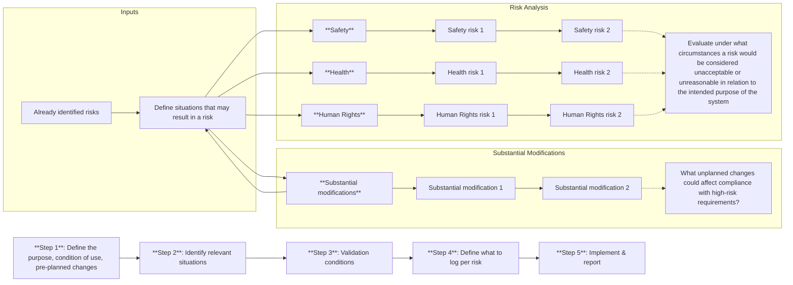

# Record-Keeping (Article 12)

|Article 12| of the AI Act sets out requirements for record-keeping by providers of high-risk AI systems.

## What is record-keeping?

Record-keeping is the practice of keeping records of events (logs) of an AI system throughout its lifetime.
This includes the automatic collection, storage, and processing of appropriate data that is relevant to the intended purpose of the AI system.

## What should be recorded?

No specific guidance is given on what concrete data should be recorded.
Rather, the necessary data should be determined based on the results of the risk assessment and the intended (reasonable forseeable) purpose of the AI system, so that any deviations from the safe operation of the AI system can be detected.

|Article 12(2)| calls for a compliant record-keeping system to capture data that allows:

-   Identification of situations that may result in the **system presenting a risk** within the meaning of |Art. 79(1)|
-   Identification of situations that may lead to a **substantial modification** of the AI system
-   [**Post-market monitoring**](#post-market-monitoring) of the AI system as defined in |Article 72|
-   [**Monitoring**](#monitoring-of-operations-by-deployers) of the AI system's operation by the deployer, as defined in |Article 26(5)|.

The draft standard [prEN ISO/IEC AWI 24970 (Artificial intelligence — AI system logging)](https://www.iso.org/standard/88723.html) will provide concrete guidance on the implementation of the event logging.
It is intended to be used with a risk management system, such as required by |Art. 9|.

For special categories of AI systems, such as remote biometrics identification systems, |Art. 12(3)| mandates additional data to be recorded.
However, these systems are out of scope for this document.

### Process description

!!! info

    The below comes from the Miro board, trying to capture a process for identifying what to log.

The following flowchart illustrates the relationship between the identified risks, substantial modifications, and the logging requirements:

For each of the identified risks and substantial modifications, the following action should be taken (step 4 in the flowchart):

-   **Developer consultation**: Check with developers if existing logs can track the events that lead to the risk. If not, define new events that need to be logged.
-   **Log importance evaluation**: Assess the cost/benefit ratio of logging the new events.
-   **Log characteristics**: Define the frequency, resolution, format, and other characteristics for each log.

Lastly, implement the logging and reporting to the governance team (step 5):

-   **Comprehensive logs**: Capture who, what, when, and outcomes of key events
-   **Stakeholder reporting**: Set up processes for accessing logs and reporting
-   **Access management**: Define who can access logs and under what conditions
-   **Model logging**: Record input/output data, timestamps, expected outputs, and user changes
-   **Violation logs**: Extend logs to include performance and MLOps KPI violations
-   **Detailed event logs**: Maintain logs of significant events, including performance metrics and user actions

## Post-Market Monitoring

Providers of high-risk AI systems must establish a post-market monitoring system to ensure that the AI system continues to comply with the requirements of the AI Act.

|Art. 3, point (25)| defines a post-market monitoring system as follows:

> [...] all activities carried out by providers of AI systems to collect and review experience gained from the use of AI systems they place on the market or put into service for the purpose of identifying any need to immediately apply any necessary corrective or preventive actions;

A post-market monitoring system for high-risk AI systems must fulfill the following requirements, as set out in |Art. 72|:

-   Be established and documented based on a post-market monitoring plan, proportionate to the risk of the AI system
-   Allow for systematic collection, documentation, and analysis of performance data to evaluated the ongoing compliance of the AI system with the requirements for high-risk AI systems
-   If necessary, interactions with other AI systems must be analysis

If the system falls under established Harmonized legislation and a post-market surveillance system is already in place, the requirements of |Art. 72| can be fulfilled by integrating the template from |Art. 72(3)| with the existing systems/plans.

In particular, the EU Commission will publish a template for the post-market monitoring plan by February 2026 (see |Art. 72(3)|).
This template will describe the elements to be included in the plan as part of the technical documentation for the AI system.

!!! todo

    Maybe elaborate here how these requirements relate to established practice, e.g., for medical devices.

## Monitoring of Operations by Deployers

Deployers of high-risk AI systems must monitor the operation of the AI system to ensure that it complies with the requirements of the AI Act.
|Art. 26(5)| requires them to:

-   **Monitor systems** based on the instructions for use
-   If using the system (in accordance with the instructions for use) could present a risk under |Art. 79(1)|, to **inform the provider** or distributor and the relevant market surveillance authorities (see |Art. 3, point (26)|) and suspend use of the system.
-   **Report any serious incidents** (see |Art. 3, point (49)|) to the provider first, and then to importer/distributor and the relevant market surveillance authorities of that incident.

Notifications to the providers should be made in accordance with |Art. 72|, which ties together the responsibilities of the deployer and the provider in the post-market monitoring of the AI system.
In case the provider cannot be reached, the notification duties outlined in |Art. 73| fall on the deployer.

Special provisions apply to law enforcement authorities and financial institutions, but are out of scope for this document.

|Art. 26(6)| requires the automatically generated logs to be kept for a period appropriate to the intended use of the system, but at least 6 months.
If any other legal requirements apply (e.g., recording requirements under GDPR), the logs must be kept for the longer of the two periods.

!!! todo

    Link to GDPR to be clarified.

## Checklist

!!! info

    From the Miro board

|Article 12(2)(a)| requirements:

-   [ ] Conditions under which a risk is deemed unacceptable in relation to the (reasonably foreseeable) intended use have been identified
-   [ ] Conditions under which a system might be substantially modified have been identified
-   [ ] Log metrics to track events that might lead to these conditions have been identified and documented

|Article 12(2)(b) and (c)| requirements:

-   [ ] Events that could affect compliance have been identified and relevant log metrics have been prepared
-   [ ] Events that could affect the performance of the system have been identified and relevant log metrics have been identified and documented

## Next Steps

-   Define and document logging architecture
    -   Reliability (long-term storage, backups, ...)
    -   Scalability
    -   Privacy requirements? (e.g., when working with personal data under GDPR)
-   Determine if the post-market monitoring activities can be automated
    -   Check medical device domain
-   Based on the risk assessment, identify situations that may result in a risk and substantial modifications and define what to log
