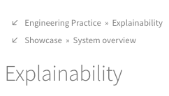

!!! warning "Legal Disclaimer"

    The information provided on this website is for informational purposes only and does not constitute legal advice.
    The tools, practices, and mappings presented here reflect our interpretation of the EU AI Act and are intended to support understanding and implementation of trustworthy AI principles.
    Following this guidance does not guarantee compliance with the EU AI Act or any other legal or regulatory framework.

    We are not affiliated with, nor do we endorse, any of the tools listed on this website.

## Who is this website for?

This project is intended for AI practitioners, data scientists, and engineers who are interested in implementing trustworthy AI systems under the European AI Act.

The information is applicable to both low- and high-risk AI systems, since it establishes a sound engineering foundation for developing trustworthy AI systems in general.

Most content is written from the perspective of providers of AI systems under the AI Act.
Deployers of such AI systems may also find the information useful, as it provides a solid foundation for understanding the requirements and best practices for compliance.

## Syllabus

This project is structured around three interconnected areas, each addressing a key aspect of AI system development in the context of EU AI Act compliance. The content is modular and designed for flexible navigation—readers are encouraged to explore the connections between legal requirements, engineering practices, and implementation choices.

A central aim of this work is to bridge the gap between regulatory obligations and technical execution. By making the relationships between legal texts, software engineering practice, and actual implementations explicit, we hope to support teams in building AI systems that are not only effective, but also aligned with compliance goals from the ground up.

-   [**Showcase**](showcase/index.md): Presents a practical use case that runs throughout the project. It illustrates the application of compliance concepts in context and includes a risk classification based on the EU AI Act.
-   [**Engineering Practice**](engineering-practice/index.md): Provides a set of software engineering best practices that form the technical foundation for compliance. Each practice is mapped to relevant AI Act provisions to guide implementation.
-   [**AI Act Conformity**](conformity/index.md): Breaks down the legal requirements of the EU AI Act and connects them to concrete engineering actions, helping translate regulatory language into actionable guidance.

Depending on your background, different entry points may make more sense.
If you're from a technical or engineering background, you might start with [Engineering Practice](engineering-practice/index.md). If you're approaching from a legal, regulatory, or policy perspective, [AI Act Conformity](conformity/index.md) may be the best starting point.
If you prefer to see things in context first, the [Showcase](showcase/index.md) offers a concrete example that ties the other sections together.

## Recommended Knowledge

-   A basic understanding of machine learning and AI concepts
-   An understanding of the terminology in |Art. 3| of the AI Act
-   Familiarity with Python programming, if you want to follow along with the code examples
-   Software engineering best practices for ML:
    -   See the [Beyond Jupyter series](https://transferlab.ai/trainings/beyond-jupyter/) for an introduction

## How to navigate this website?

A key goal of this project is making connections between AI Act requirements and engineering best practices explicit.
Since these relationships are often many-to-many rather than one-to-one, the website uses multiple navigation tools to help you explore these connections:

-   _Overview Tables_: Both the [Engineering practice](engineering-practice/index.md) and [AI Act Conformity](conformity/index.md) sections contain summary tables showing the relationships between practices and requirements.

-   _Information Boxes_: Each page in these sections includes specialized information boxes:
    -   Pages in [Engineering practice](engineering-practice/index.md) include [Compliance Information Boxes](#compliance-information-boxes) linking to _relevant AI Act requirements_
    -   Pages in [AI Act Conformity](conformity/index.md) include [Engineering Information Boxes](#engineering-information-boxes) linking to _relevant engineering practices_

These tools help you navigate the complexity of implementing AI Act requirements through sound engineering practices, allowing you to move seamlessly between legal requirements and their technical implementations.

### Compliance Information Boxes

The pages on engineering practices include information boxes that reference applicable parts of the AI Act.
For an example, see the box at the bottom of this section.
These references are intended to help you understand how the engineering practices relate to the legal requirements of the AI Act.

Please note that these references do not imply that following a given engineering practice will guarantee compliance with the referenced parts of the AI Act.

!!! success "Compliance Info"

    This is an example for the Compliance Info box.

    - **|Art. 14|** (Human Oversight), in particular:
        - |Art. 14(4)(e)|, continuous monitoring the operation of the systems helps
            to detect conditions requiring potential intervention

### Engineering Information Boxes

Given the requirements of the AI Act, it is interesting to link certain requirements to the corresponding engineering practices.
These connections are represented by information boxes, like the one at the bottom of this section.
You can think of them as the reverse direction of the connections collected in [Compliance Information Boxes](#compliance-information-boxes).

Following these practices does not guarantee compliance, as there may be parts of a requirement that are not amenable to automation.

!!! info "Engineering Info"

    This is an example for the Compliance Info box.

    - [**Operational Monitoring**](engineering-practice/operational-monitoring.md):
        -   |Art. 14(4)(e)|, continuous monitoring the operation of the systems helps
            to detect conditions requiring potential intervention

### Page Backlinks

You might notice that some pages contain hyperlinks to other pages marked with an <em>↙</em> arrow at the top of the page:

<figure markdown="span">
{ align=center }
</figure>

These links point to other pages on this website that contain links to the current page.
They help you easily discover and navigate related content, even if it is not mentioned in the info box of the page.

## What is out of scope?

### Assessing your use case's risk category

If you are unsure how the AI Act applies to your use case, you should first try to determine the appropriate risk classification for your use case.

The following resources can help you with that:

-   The appliedAI Institute [Risk Classification Database](https://www.appliedai-institute.de/en/risk-classification-database), a comprehensive list of practical examples of high-risk and non high-risk use cases on AI systems under the EU AI Act
-   The [EU Act Compliance Checker](https://artificialintelligenceact.eu/assessment/eu-ai-act-compliance-checker/), an interactive tool that helps you assess the risk category of your AI system and applicable requirements from the AI Act

### Systems covered under European Union harmonisation legislation

If your system is covered under European Union harmonisation legislation (see |Annex I|), both the AI Act and the rules in those laws apply.
We do not cover these additional requirements in this showcase.

### General-purpose AI models

The AI Act also creates a special category of AI systems, called **general purpose AI systems**, where a general purpose AI model is integrated into a larger software product.
These are a special category of AI systems, for which the rules for high-risk systems continue to apply.
If you are building a general-purpose AI system, you will still find the engineering resources useful, since they mirror good software engineering practices.

The AI Act also creates separate rules for general purpose AI models (e.g. foundation models like LLMs) and AI systems.
However, this resource is specifically tailored to the requirements for high-risk AI systems.

The rules for general purpose AI models are contained in [Chapter V](https://artificialintelligenceact.eu/chapter/5/) of the AI Act.
For guidance on how to comply with Chapter V of the AI Act, you might find the following resources helpful:

-   The [European AI Office](https://digital-strategy.ec.europa.eu/en/policies/ai-office), which oversees the implementation of the AI Act, while ensuring compliance, fostering innovation, and coordinating AI governance across EU Member States.
-   The [General-Purpose AI Code of Practice](https://digital-strategy.ec.europa.eu/en/policies/ai-code-practice), and an [explorer for the draft Code of Practice](https://code-of-practice.ai).

### Relationship to Privacy and Data Protection

The project does not address the relationship between the AI Act and the General Data Protection Regulation (GDPR), or the question of privacy in Machine Learning more broadly.

The AI Act and the GDPR are separate legal frameworks, and while they may overlap in some areas, they have different objectives and requirements.
Although some of the engineering practices on this website also help you comply with the GDPR, we do not explicitly consider these privacy and data protection aspects.

## On the iterative nature of this document

As the legislation and standardization around artificial intelligence in the European Union still evolve, this showcase is subject to changes based on different types of developments.
These can include, but are not limited to:

1. Community feedback, like corrections and additions of missing content,
2. Changes and updates to standards on artificial intelligence, such as through CEN-CENELEC (see below),
3. Changes to the technology stack used in the example high-risk AI system.

Providers of high-risk AI systems specifically may also consider the following note on the future availability of EU harmonized standards.

!!! note

    Providers of high-risk AI systems must build their systems according to the rules in Chapter III, Section 2 of the AI Act as discussed in the [AI Act Conformity](conformity/index.md) section of this website.

    To benefit from a presumption of conformity with these rules, providers must apply harmonized standards in their design and implementation process.
    These standards are due to be published by CEN-CENELEC between late 2025 and early 2026.

    Please refer to the [CEN-CENELEC JTC 21 website](https://standards.cencenelec.eu/dyn/www/f?p=205:22:0::::FSP_ORG_ID,FSP_LANG_ID:2916257,25&cs=1827B89DA69577BF3631EE2B6070F207D) for up-to-date information.
