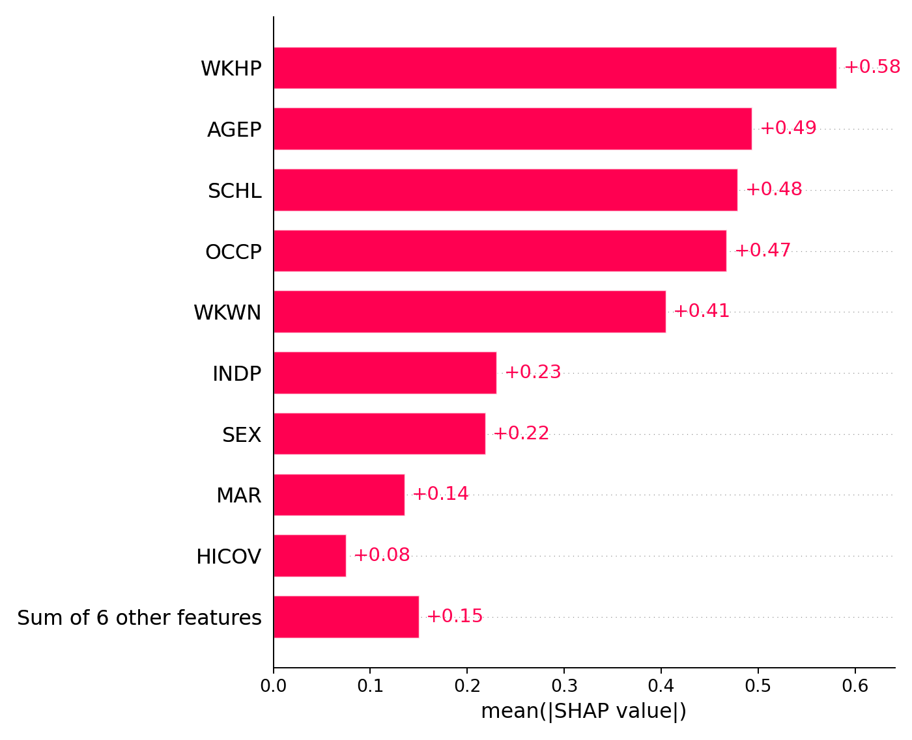
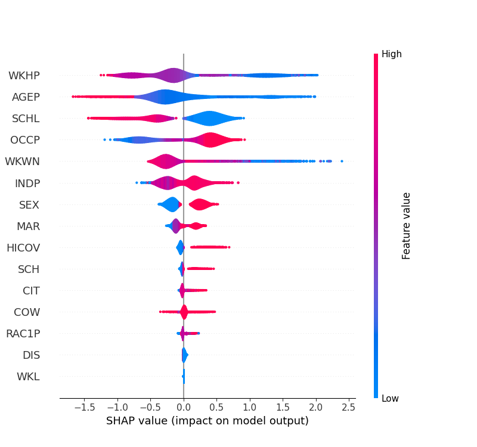
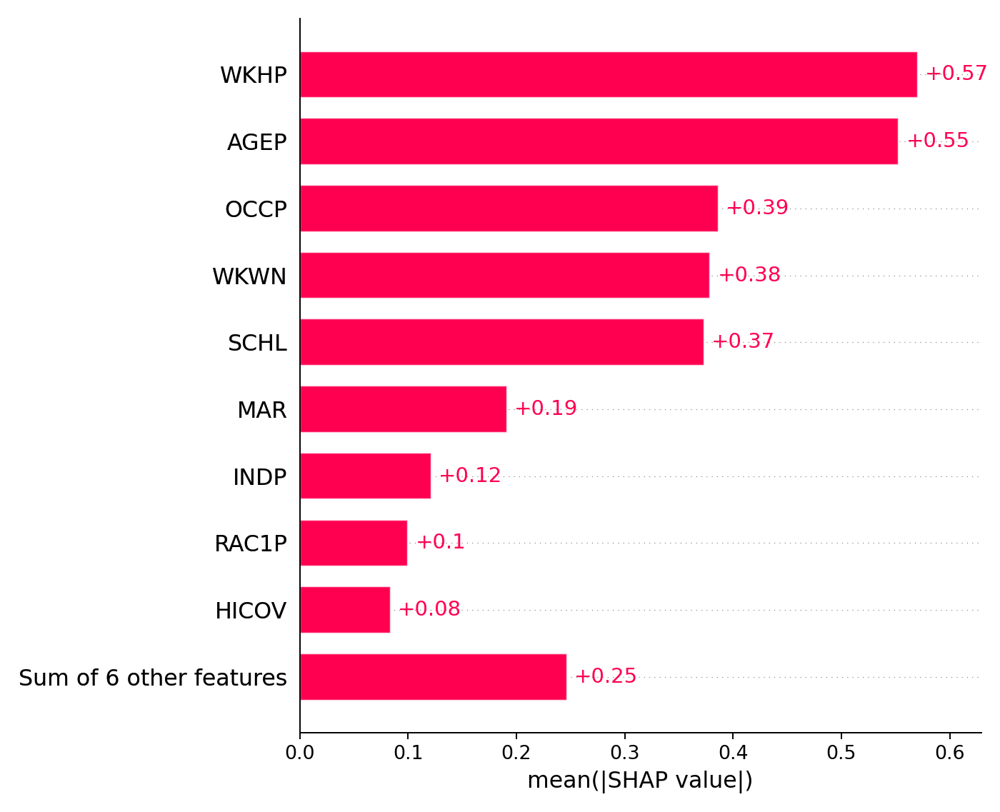
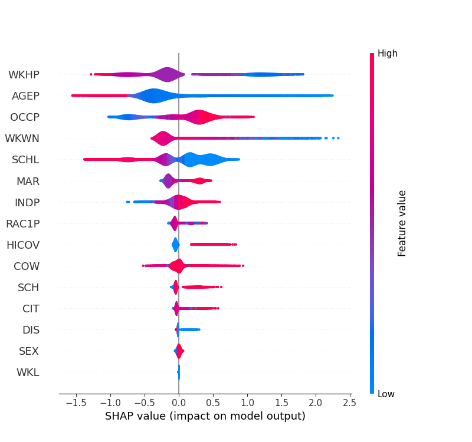

# Bias Detection and Mitigation

!!! note

    While the dataset used in the showcase system contains multiple protected characteristics in the context of employment access (e.g., race, sex, age, disability status, ...), the implementation focuses on detecting and mitigating bias related to sex for demonstration purposes.

    Setting appropriate thresholds and metrics for detection of unacceptable bias is a complex task that requires careful consideration of the specific context and the potential impact of the model's predictions.

## Bias Detection

Two main types of bias are considered in the showcase system:

-   bias inherent to the dataset, which refers to the potential biases present in the training data that can lead to unfair predictions;
-   bias stemming from the ML model, which refers to the potential biases introduced by the model itself during training or inference.

Various metrics are calculated to assess the fairness of the model's predictions.
These metrics are logged to the MLflow experiment log during training, in order to be able to assess the model's fairness across different versions.

Two Python packages are used to calculate the relevant metrics:

-   [Fairlearn](https://fairlearn.org/): a toolkit for assessing and mitigating unfairness in machine learning models.
-   [AIF360](https://aif360.res.ibm.com/): a comprehensive toolkit for detecting and mitigating bias in AI systems.

## Bias Mitigation

As an example for a bias mitigation technique, the showcase system implements a correlation removal pre-processing step.
This pre-processing transformation is implemented using the [Fairlearn](https://fairlearn.org/v0.12/user_guide/mitigation/preprocessing.html#correlation-remover) library.

In line with the [risk assessment](../risk-assessment.md) for the showcase, the `SEX` feature is identified as a sensitive attribute that should be considered for bias mitigation.

The mitigation is applied to the training data before training the model, and the model is then trained on the mitigated dataset.
This helps to ensure that the model does not learn biased patterns from the training data, leading to fairer predictions, at the expense of slightly worse model accuracy.

The following plots compare the feature importance of the `SEX` feature for models that have been trained on the original dataset and on the mitigated dataset (see the page on [explainability](../../engineering-practice/explainability.md) for more details on the the SHAP approach).
The plots on the left show the feature importance for the unmitigated dataset, while the plots on the right show the feature importance for the mitigated dataset.

    <figure markdown="span">
        
        
        <figcaption>Unmitigated dataset</figcaption>
    </figure>
    <figure markdown="span">
        
        
        <figcaption>Mitigated dataset</figcaption>
    </figure>

Note that the mitigation successfully reduced the importance of the `SEX` feature, which can be seen in the decreased range of the SHAP values in the violin plot for this feature in the mitigated dataset.
The bar plot shows that the overall feature importance of the `SEX` feature is also reduced so far that it is no longer among the top 10 most important features in the model.
