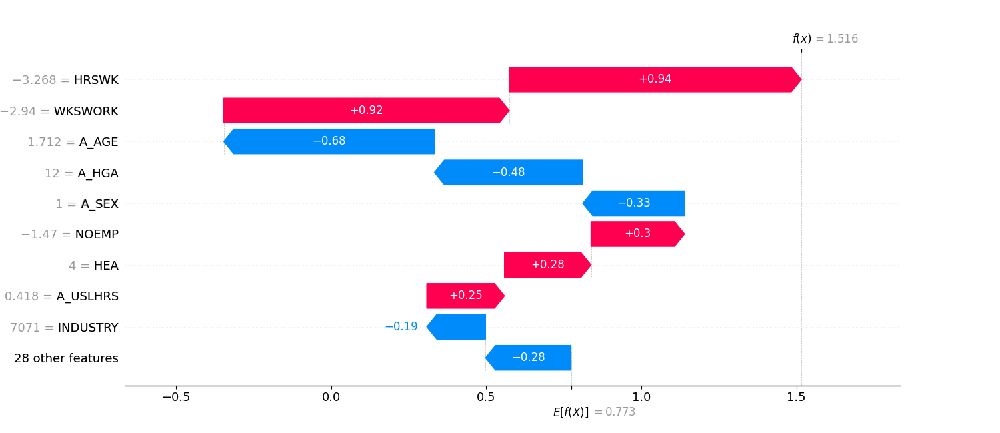

# Explainability

Our showcase implementation focusses on a single explainability technique, the [SHAP](https://shap.readthedocs.io/en/latest/) (SHapley Additive exPlanations) approach.
This game-theoretic approach allows for post-hoc explanations in the form of highlighting each input feature's contribution to the model prediction.

## Custom MLServer Runtime with Explainability

This section describes the exemplary implementation of a system that automatically generates explanations for every prediction made by the underlying model.
A custom [inference server](../../engineering-practice/model-serving.md) runtime implementation in MLserver is used to attach these SHAP explanations to every model prediction.

This design of predictions linked with explanations ensures that every prediction made by the system can be explained at a later point in time, without the need for the original input data or model revision at the time of the explanation.
Contrast this with an implementation that requires access to the deployed model revision when an explanation is requested.
In such a case, the model revision would need to be available (or deployed on demand) to generate the explanation post-hoc.

## Explainability API in the Application

The AI system exposes an API endpoint (`/model/explain`) that allows a user to request explanations for a given model prediction.
Predictions are identified by their request ID, which is automatically attached to the system's response in the `X-Request-ID` HTTP header.

For a given inference request ID, the system retrieves the corresponding input, output, and explanation data from the [inference log](../../engineering-practice/inference-log.md), and returns a visual representation of the SHAP explanation for the prediction to the user:

