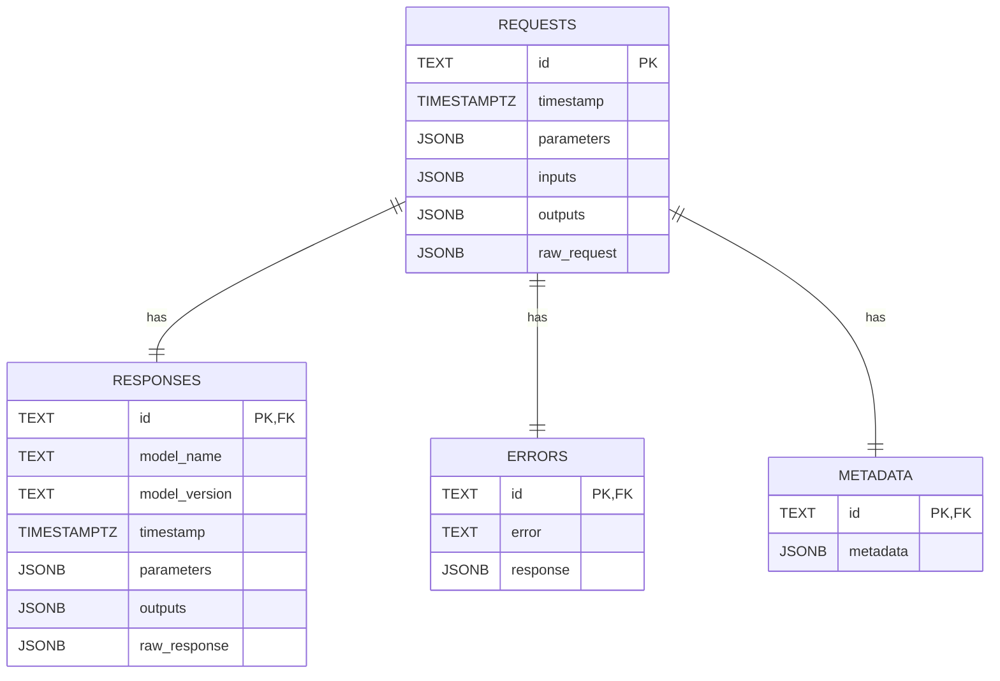
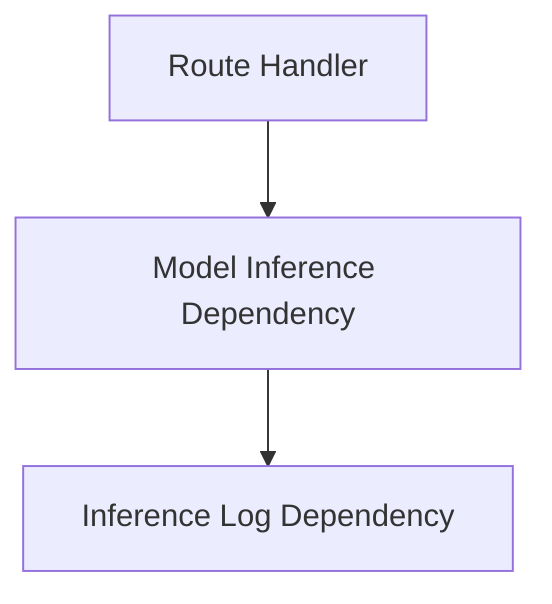

# Inference Logging

## Database Schema

The database schema for the inference log should include tables for storing the following information:

-   **Requests**: Information about the inference requests, including the input data, model used, and timestamp.
-   **Responses**: Information about the inference responses, including the output data and timestamp.
-   **Errors**: Information about any errors that occurred during inference, including the error message and the response data.
-   **Metadata**: Additional metadata about the inference requests and responses.

In order to allow for a variety of data types and structures, the input and output data should be stored as JSON or JSONB fields.
The data types from the standardized [_Open Inference Protocol v2 REST API specification_](https://github.com/kserve/open-inference-protocol/blob/main/specification/protocol/inference_rest.md) can be used as a reference for the structure of the input and output data.
Using a standardized data structure will make it easier to integrate the inference log with other components of the AI system, such as the [model performance monitoring](../../engineering-practice/model-monitoring.md) component.

Choose a database or storage solution that supports the required data structure and provides the necessary performance and scalability characteristics for the AI system's workload.
Additionally, consider the data retention requirements of |Art. 19| and the need for data protection and privacy (e.g., interactions with GDPR) when selecting a log storage solution.

## FastAPI Application Middleware

In order to ensure that all inference requests are automatically logged, the inference log should be implemented as a middleware component in the AI system's application code.

The middleware should intercept all incoming inference requests, log the relevant data, and then pass the request on to the model (inference server) for processing.

When using the FastAPI, the inference log can be injected as a _dependency_ into the application's route handlers or other dependencies.
By further encapsulating the interface to the model itself in another dependency, the inference log can be easily integrated into the application's request handling pipeline.

<figure>

</figure>
